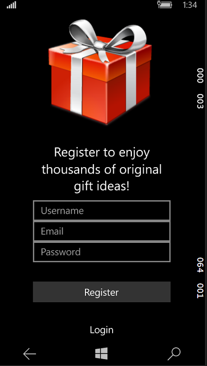
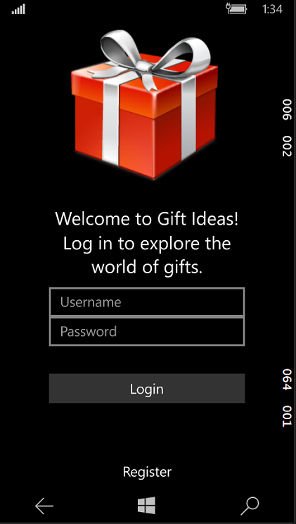
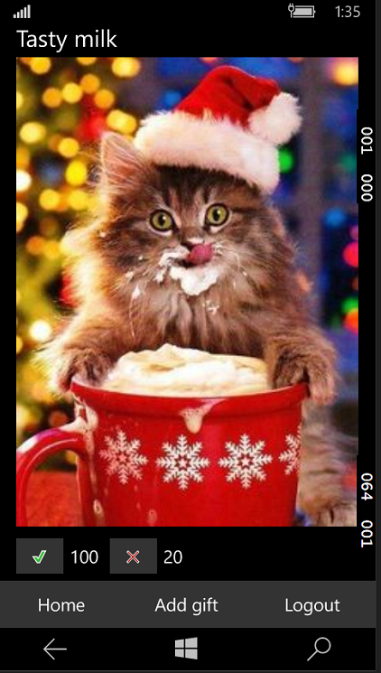
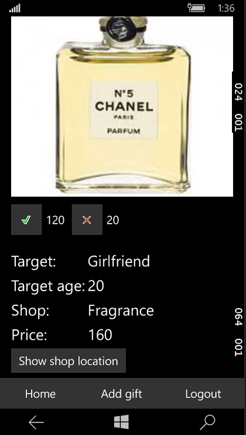
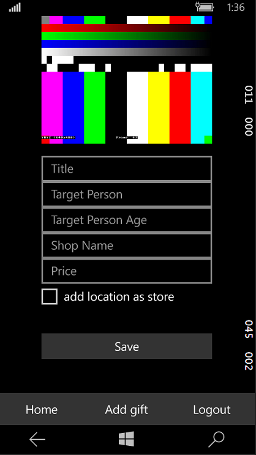
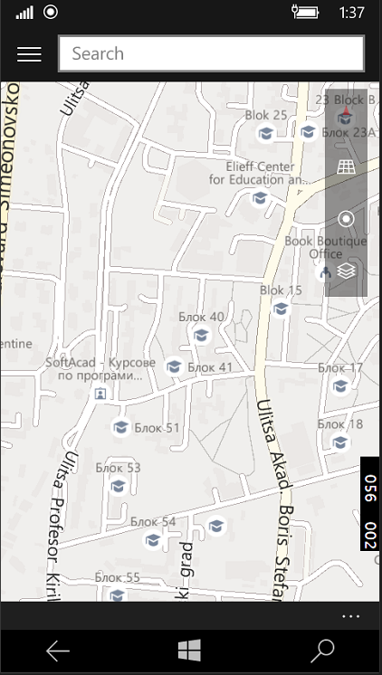

# Gift Ideas - Windows Universal App
## App idea
The purpose of the app is to help people find presents for their close ones. Every one of us has been in the situation when we are wondering what should we buy to our mother/father/soulmate/friend/etc. That is when Gift Ideas comes to help. Here you can view many gift ideas uploaded from other users or you can even upload a gift you have bought to help others. Every gift idea comes with some information: a picture of the object, the target person, the age of the target person, price of the gift, shop name and shop location. This is all you need in order to buy the gift for your close ones.
## App views
### Rgistration screen: 

### Login screen: 

### All gifts screen: 

### Gift details screen: 

### Add gift screen: 

### Map screen: 
